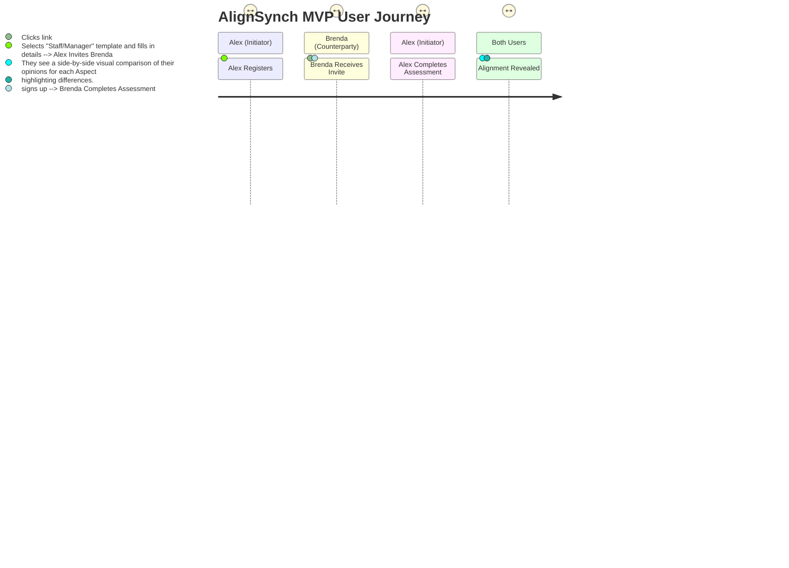
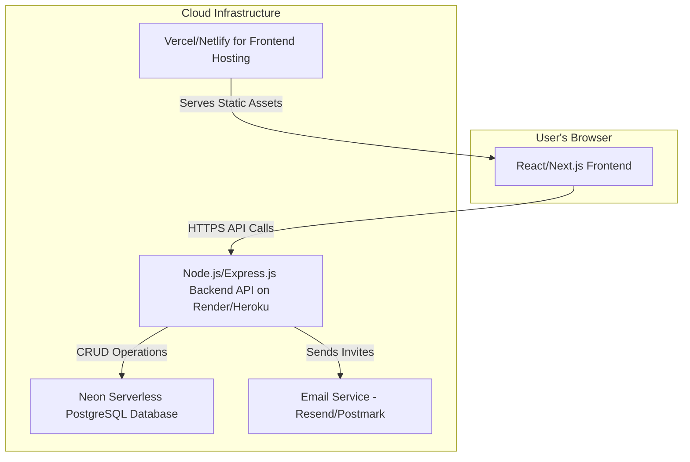

Of course. I will now generate a comprehensive, single-document Product Requirements Document (PRD) designed to serve as a complete, "paint-by-numbers" blueprint for building the AlignSynch MVP.

This document synthesizes all provided context: your initial schema, the detailed application screenshots, the architectural notes, and the core user flows. It is structured for an agentic development workflow, incorporating a test-first methodology, feature flags, and a phased implementation plan.

---

## **AlignSynch: MVP Product Requirements Document (PRD)**

**Version:** 1.0
**Date:** 2025-09-05
**Project:** AlignSynch MVP Build
**Single Source of Truth:** This document is the definitive guide for the MVP. All development, design, and testing should refer to this specification.

### **Table of Contents**

1.  [**Vision & MVP Scope**](#1-vision--mvp-scope)
2.  [**Personas & Core User Journeys**](#2-personas--core-user-journeys)
3.  [**System Architecture**](#3-system-architecture)
4.  [**Detailed Database Schema**](#4-detailed-database-schema)
5.  [**API Specification (OpenAPI 3.0)**](#5-api-specification-openapi-30)
6.  [**Project File Structure**](#6-project-file-structure)
7.  [**UI/UX Specification & Detailed Page Mockups**](#7-uiux-specification--detailed-page-mockups)
8.  [**Implementation Plan & Phased Rollout**](#8-implementation-plan--phased-rollout)
9.  [**Testing Strategy**](#9-testing-strategy)

---

### **1. Vision & MVP Scope**

#### **1.1 Elevator Pitch**

AlignSynch is a private, cloud-based "Soft Communication Tool" that helps professional and personal relationships get in sync and stay harmonized. It replaces subjective conversations with a structured, private way to handle expectations and uncover gaps in understanding before they become problems. It is a "Relationship Risk Management App," an "Expectation Management Gadget," and a "Feedback Portal" all in one.

#### **1.2 Core Problem**

Relationships falter due to misaligned expectations. People can talk for hours and still not be on the same page. AlignSynch provides the objectivity needed to effectively communicate by focusing on four key questions:

1.  How do YOU feel it is now?
2.  How do YOU wish it to slowly change?
3.  How do you THINK they feel it is now?
4.  How do you GUESS they wish it to slowly change?

#### **1.3 MVP Scope: What's In & What's Out**

The goal of the MVP is to deliver the core value proposition: allowing two parties to successfully create, assess, and align a single relationship.

| Feature               | **IN MVP**                                                                                                 | **OUT of MVP (Post-Launch)**                                                       |
| :-------------------- | :--------------------------------------------------------------------------------------------------------- | :--------------------------------------------------------------------------------- |
| **User Roles**        | Initiator, Counterparty                                                                                    | Coach                                                                              |
| **Relationships**     | Create from a pre-defined template, Invite one Counterparty, Basic & Advanced Modes, Soft & Full Settings. | Creating custom templates, Multi-Counterparty relationships, Relationship cloning. |
| **Assessment**        | Both users privately submit all opinions (Feel, Wish, Think, Guess).                                       | Real-time updates, partial submissions.                                            |
| **Results**           | A static "Gap Analysis" view is revealed once both parties submit.                                         | Historical trend analysis, advanced reporting, progress tracking dashboards.       |
| **Communication**     | Email-based invitation system.                                                                             | In-app messaging/chat at the Aspect level.                                         |
| **Authentication**    | Standard Email/Password Registration & Login.                                                              | Social logins (Google, etc.), SSO.                                                 |
| **Billing**           | All MVP features are free.                                                                                 | Subscription plans (Basic, Essential, Max), payment integration.                   |
| **Aspect Management** | Aspects are defined by the template.                                                                       | Proposing changes to Aspect names/values for counterparty approval.                |

---

### **2. Personas & Core User Journeys**

#### **2.1 Personas**

- **Alex (The Initiator):** A proactive user who wants to bring clarity to a relationship. They are responsible for setting up the relationship, defining its terms, and inviting the other party.
- **Brenda (The Counterparty):** The user invited to the relationship. They need a secure and private way to share their perspective without fear of immediate judgment.

#### **2.2 Core MVP User Journey**

This journey map outlines the "happy path" for the MVP.



---

### **3. System Architecture**

A standard, scalable web application architecture will be used.



---

### **4. Detailed Database Schema**

This schema is normalized to reflect the complexity shown in the provided context images. It uses `drizzle-orm` syntax.

```typescript
// file: /src/db/schema.ts
import {
  pgTable,
  serial,
  varchar,
  text,
  timestamp,
  boolean,
  integer,
  uniqueIndex,
  pgEnum,
  primaryKey,
} from "drizzle-orm/pg-core";

// --- ENUMS ---
export const relationshipModeEnum = pgEnum("relationship_mode", [
  "Basic",
  "Advanced",
]);
export const relationshipSettingEnum = pgEnum("relationship_setting", [
  "Soft",
  "Full",
]);
export const inviteStatusEnum = pgEnum("invite_status", [
  "pending",
  "accepted",
  "revoked",
]);
export const opinionTypeEnum = pgEnum("opinion_type", [
  "feel",
  "wish",
  "think",
  "guess",
]);

// --- TABLES ---
export const users = pgTable("users", {
  id: serial("id").primaryKey(),
  email: varchar("email", { length: 255 }).notNull().unique(),
  firstName: varchar("first_name", { length: 100 }),
  lastName: varchar("last_name", { length: 100 }),
  createdAt: timestamp("created_at").defaultNow().notNull(),
});

export const relationships = pgTable("relationships", {
  id: serial("id").primaryKey(),
  name: varchar("name", { length: 255 }).notNull(),
  type: varchar("type", { length: 100 }).default("Business"), // "Business", "Personal"
  realm: varchar("realm", { length: 255 }), // "Office"
  descriptor: text("descriptor"),
  mode: relationshipModeEnum("mode").default("Basic").notNull(),
  setting: relationshipSettingEnum("setting").default("Soft").notNull(),
  initiatorId: integer("initiator_id")
    .references(() => users.id, { onDelete: "cascade" })
    .notNull(),
  version: integer("version").default(1),
  createdAt: timestamp("created_at").defaultNow().notNull(),
  updatedAt: timestamp("updated_at").defaultNow().notNull(),
});

export const relationshipParticipants = pgTable(
  "relationship_participants",
  {
    relationshipId: integer("relationship_id")
      .references(() => relationships.id, { onDelete: "cascade" })
      .notNull(),
    userId: integer("user_id")
      .references(() => users.id, { onDelete: "cascade" })
      .notNull(),
    roleName: varchar("role_name", { length: 100 }).notNull(), // e.g., "Manager", "Staff"
    // Submission status to unlock the Gap Analysis view
    submissionStatus: boolean("submission_status").default(false),
  },
  table => {
    return {
      pk: primaryKey(table.relationshipId, table.userId),
    };
  }
);

export const aspects = pgTable("aspects", {
  id: serial("id").primaryKey(),
  relationshipId: integer("relationship_id")
    .references(() => relationships.id, { onDelete: "cascade" })
    .notNull(),
  name: text("name").notNull(),
  leftValue: varchar("left_value", { length: 100 }).notNull(),
  rightValue: varchar("right_value", { length: 100 }).notNull(),
  displayOrder: integer("display_order").default(0),
});

export const opinions = pgTable(
  "opinions",
  {
    id: serial("id").primaryKey(),
    aspectId: integer("aspect_id")
      .references(() => aspects.id, { onDelete: "cascade" })
      .notNull(),
    userId: integer("user_id")
      .references(() => users.id, { onDelete: "cascade" })
      .notNull(),
    opinionType: opinionTypeEnum("opinion_type").notNull(),
    value: integer("value").notNull(), // Storing the slider value, e.g., 1-5
    updatedAt: timestamp("updated_at").defaultNow().notNull(),
  },
  table => {
    return {
      unq: uniqueIndex("user_aspect_opinion_unique").on(
        table.aspectId,
        table.userId,
        table.opinionType
      ),
    };
  }
);

export const invites = pgTable("invites", {
  id: serial("id").primaryKey(),
  relationshipId: integer("relationship_id")
    .references(() => relationships.id, { onDelete: "cascade" })
    .notNull(),
  inviterId: integer("inviter_id")
    .references(() => users.id, { onDelete: "cascade" })
    .notNull(),
  inviteeEmail: varchar("invitee_email", { length: 255 }).notNull(),
  counterpartyRoleName: varchar("counterparty_role_name", {
    length: 100,
  }).notNull(),
  status: inviteStatusEnum("status").default("pending").notNull(),
  token: varchar("token", { length: 255 }).unique().notNull(),
  expiresAt: timestamp("expires_at").notNull(),
});
```

---

### **5. API Specification (OpenAPI 3.0)**

This defines the RESTful API contract. All endpoints require JWT Bearer Token authentication unless otherwise specified.

```yaml
openapi: 3.0.0
info:
  title: AlignSynch MVP API
  version: 1.0.0
paths:
  /auth/register:
    post:
      summary: Register a new user (No Auth)
      requestBody:
        required: true
        content:
          application/json:
            schema:
              {
                type: object,
                properties: { email, password, firstName, lastName },
              }
      responses:
        "201": { description: User created, returns user object and JWT }
  /auth/login:
    post:
      summary: Log in a user (No Auth)
      requestBody:
        required: true
        content:
          application/json:
            schema: { type: object, properties: { email, password } }
      responses:
        "200": { description: Login successful, returns user object and JWT }
  /relationships:
    get:
      summary: Get all relationships for the current user
      responses:
        "200": { description: An array of relationship objects }
    post:
      summary: Create a new relationship from a template
      requestBody:
        required: true
        content:
          application/json:
            schema:
              {
                type: object,
                properties:
                  {
                    templateName,
                    initiatorRole,
                    counterpartyRole,
                    descriptor,
                    realm,
                  },
              }
      responses:
        "201":
          {
            description: Relationship created,
            returns the full relationship object including generated aspects,
          }
  /relationships/{id}:
    get:
      summary: Get a single relationship's full details
      parameters:
        [{ name: id, in: path, required: true, schema: { type: integer } }]
      responses:
        "200":
          description: "Full relationship object. If both parties have submitted, includes all opinions. Otherwise, only includes the current user's opinions."
          content:
            application/json:
              schema:
                type: object
                properties:
                  # ... relationship fields
                  participants:
                    {
                      type: array,
                      items:
                        {
                          type: object,
                          properties: { userId, roleName, submissionStatus },
                        },
                    }
                  aspects:
                    type: array
                    items:
                      type: object
                      properties:
                        # ... aspect fields
                        opinions:
                          {
                            type: array,
                            items:
                              {
                                type: object,
                                properties: { userId, opinionType, value },
                              },
                          }
  /relationships/{id}/invites:
    post:
      summary: Invite a counterparty to a relationship
      parameters:
        [{ name: id, in: path, required: true, schema: { type: integer } }]
      requestBody:
        required: true
        content:
          application/json:
            schema:
              { type: object, properties: { email, counterpartyRoleName } }
      responses:
        "201": { description: Invite sent }
  /invites/accept/{token}:
    post:
      summary: Accept an invitation (Auth required)
      parameters:
        [{ name: token, in: path, required: true, schema: { type: string } }]
      responses:
        "200": { description: Invite accepted, user is now a participant }
  /opinions:
    put:
      summary: Submit or update a batch of opinions for a relationship
      requestBody:
        required: true
        content:
          application/json:
            schema:
              type: object
              properties:
                relationshipId: { type: integer }
                opinions:
                  type: array
                  items:
                    {
                      type: object,
                      properties: { aspectId, opinionType, value },
                    }
      responses:
        "200":
          {
            description: Opinions saved successfully. If this completes the assessment,
            the response indicates the Gap Analysis is now available.,
          }
```

---

### **6. Project File Structure**

A monorepo structure is not required for the MVP. Two separate folders for frontend and backend.

**Backend (Node.js/Express)**

```
/alignsynch-api
├── src/
│   ├── api/
│   │   ├── routes/
│   │   │   ├── auth.routes.ts
│   │   │   ├── relationships.routes.ts
│   │   │   └── ...
│   │   ├── controllers/
│   │   │   ├── auth.controller.ts
│   │   │   └── ...
│   │   ├── middlewares/
│   │   │   └── requireAuth.ts
│   ├── core/
│   │   ├── services/
│   │   │   ├── relationshipService.ts
│   │   │   └── emailService.ts
│   ├── db/
│   │   ├── migrations/
│   │   ├── schema.ts
│   │   └── index.ts
│   ├── config/
│   ├── app.ts
│   └── server.ts
├── package.json
└── tsconfig.json
```

**Frontend (Next.js with App Router)**

```
/alignsynch-web
├── src/
│   ├── app/
│   │   ├── (auth)/
│   │   │   ├── login/page.tsx
│   │   │   └── signup/page.tsx
│   │   ├── (dashboard)/
│   │   │   ├── dashboard/page.tsx
│   │   │   ├── relationships/
│   │   │   │   ├── new/page.tsx
│   │   │   │   └── [id]/page.tsx
│   │   │   └── layout.tsx
│   │   ├── api/  (for NextAuth or BFF routes)
│   │   ├── layout.tsx
│   │   └── page.tsx (Landing Page)
│   ├── components/
│   │   ├── ui/ (ShadCN-style: Button.tsx, Card.tsx, Slider.tsx)
│   │   ├── relationships/
│   │   │   ├── RelationshipCard.tsx
│   │   │   └── AspectSlider.tsx
│   │   └── auth/
│   │       └── LoginForm.tsx
│   ├── lib/ (utils, hooks)
│   ├── styles/
│   └── types/
├── package.json
└── tsconfig.json
```

---

### **7. UI/UX Specification & Detailed Page Mockups**

This section provides detailed wireframes for the key screens. These are not pixel-perfect designs but functional specifications for developers.

#### **7.1 Page: `/relationships/[id]` (The Assessment & Alignment View)**

- **Purpose:** This is the most critical page. It's where users input their opinions and view the results.
- **Data:** Powered by `GET /api/relationships/{id}`.
- **States:**
  1.  **Loading State:** Skeleton loaders for the header and aspect list.
  2.  **Assessment Pending State (Incomplete):** Shown when one or both users have not submitted their opinions. The user only sees their own sliders to input data.
  3.  **Alignment View State (Complete):** Shown only when BOTH users have `submissionStatus: true`. Displays the full Gap Analysis.

**Detailed Mockup: Alignment View State**

```
+----------------------------------------------------------------------------------+
| Header                                                                           |
|----------------------------------------------------------------------------------|
| Relationship: Staff / Manager                                                    |
| Initiator: Alex (Staff) | Counterparty: Brenda (Manager)                          |
| Mode: Advanced | Setting: Soft                                                   |
+==================================================================================+
| Main Content                                                                     |
|----------------------------------------------------------------------------------|
|                                                                                  |
| ▼ Aspect 01: Variety of Work (Detail vs. Strategy)                               |
| +--------------------------------------------------------------------------------+
| |                                                                                |
| |   FEEL: How do YOU FEEL it is now?                                             |
| |   You:    Detailed <|----●----|> Strategic  [Value: 3]                         |
| |   Brenda: Detailed <|--●------|> Strategic  [Value: 2]                         |
| |   [Gap Analysis: Feel Gap = 1]                                                 |
| |                                                                                |
| |   WISH: How do YOU WISH it to SLOWLY change?                                   |
| |   You:    Detailed <|------●--|> Strategic  [Value: 4]                         |
| |   Brenda: Detailed <|------●--|> Strategic  [Value: 4]                         |
| |   [Gap Analysis: Wish Gap = 0 - ALIGNED!]                                      |
| |                                                                                |
| |   THINK: How do YOU THINK, THEY FEEL it is now?                                |
| |   You:    Detailed <|-●-------|> Strategic  [Value: 1]                         |
| |   Brenda: Detailed <|--●------|> Strategic  [Value: 2]                         |
| |   [Gap Analysis: Think Gap = 1]                                                |
| |                                                                                |
| |   GUESS: How do YOU GUESS THEY WISH it to SLOWLY change?                        |
| |   You:    Detailed <|-------●-|> Strategic  [Value: 5]                         |
| |   Brenda: Detailed <|------●--|> Strategic  [Value: 4]                         |
| |   [Gap Analysis: Guess Gap = 1]                                                |
| |                                                                                |
| +--------------------------------------------------------------------------------+
|                                                                                  |
| ► Aspect 02: Quantity of Work (Little vs. Lots)                                  |
|                                                                                  |
| ... (other aspects collapsed by default)                                         |
+----------------------------------------------------------------------------------+
```

---

### **8. Implementation Plan & Phased Rollout**

This project will be developed in logical, testable phases. Each phase represents a feature-flagged release.

**Phase 1: Foundation & User Authentication (Sprint 1-2)**

- **Epic:** Setup & Auth
- **Stories:**
  - Initialize Next.js and Express projects.
  - Setup CI/CD pipeline for automated testing.
  - Implement database schema (Users table).
  - Build user registration and login API endpoints.
  - Create Login and Signup pages on the frontend.
  - Implement JWT-based session management.
- **Feature Flag:** `enable-auth` (on by default).

**Phase 2: Core Relationship & Aspect CRUD (Sprint 3-4)**

- **Epic:** Relationship Management
- **Stories:**
  - Implement DB schema (Relationships, Aspects).
  - Create API endpoints for `POST` and `GET /relationships`.
  - Build the "Create Relationship from Template" form.
  - Build the Dashboard page to list a user's relationships.
  - The `/relationships/[id]` page should display aspects but without opinion sliders yet.
- **Feature Flag:** `enable-relationship-creation`.

**Phase 3: Opinion Submission Flow (Sprint 5-6)**

- **Epic:** Assessment Core
- **Stories:**
  - Implement DB schema (Opinions, `submissionStatus` on Participants).
  - Create the `PUT /api/opinions` endpoint for batch updates.
  - Build the `AspectSlider` component on the frontend.
  - Implement the "Assessment Pending State" on the relationship page.
  - Logic to update `submissionStatus` when a user submits all opinions.
- **Feature Flag:** `enable-opinion-submission`.

**Phase 4: Gap Analysis & Invitation System (Sprint 7-8)**

- **Epic:** Alignment & Invites
- **Stories:**
  - Implement DB schema (Invites, update Participants table).
  - Create API endpoints for sending and accepting invites.
  - Implement the email service to send invite links.
  - Build the UI for inviting a user from the relationship page.
  - Implement the "Alignment View State" on the relationship page, including gap calculation logic.
- **Feature Flag:** `enable-invitations`.

---

### **9. Testing Strategy**

A test-first approach is mandatory.

- **Unit Tests (Vitest/Jest):**
  - **Scope:** Individual functions, business logic.
  - **Example:** A function `calculateGap(opinionA, opinionB)` will be tested with various inputs (`(3, 5) -> 2`, `(4, 4) -> 0`) before it is written.
  - **Location:** `*.test.ts` files co-located with the source files.

- **API Integration Tests (Supertest):**
  - **Scope:** API endpoint contracts (request/response validation).
  - **Example:** A test for `POST /relationships` will send a valid body with a valid auth token and assert that the response is `201` and contains the expected data structure. It will also test failure cases (no token, bad data).
  - **Location:** `/tests` directory in the API project.

- **End-to-End (E2E) Tests (Playwright/Cypress):**
  - **Scope:** Full user journeys in a browser.
  - **Example:** An E2E test script will:
    1.  Programmatically create two users in a test database.
    2.  Log in as User A.
    3.  Navigate to `/relationships/new`, fill out the form, and create a relationship.
    4.  Invite User B via the UI.
    5.  Intercept the invite token.
    6.  Log out.
    7.  Visit the invite link and log in as User B.
    8.  Complete the assessment.
    9.  Log in as User A, complete the assessment.
    10. Assert that the Gap Analysis view is now visible and displays the correct data.
  - **Location:** Separate test suite that runs against a staging environment.
